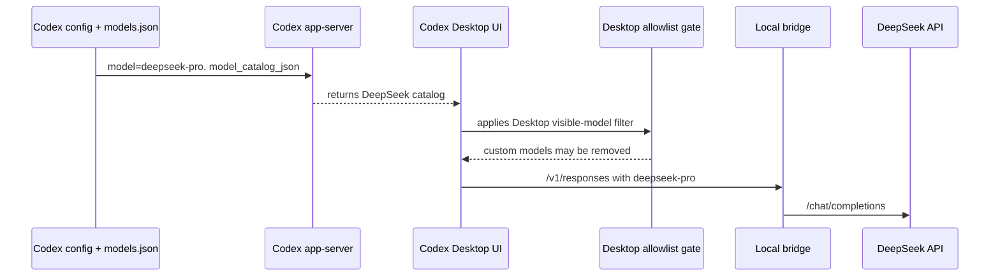

# Codex DeepSeek Bridge

Use DeepSeek inside the OpenAI Codex app through a tiny local Responses-compatible bridge.

Default setup keeps the official Codex configuration path and publishes one model:
`deepseek-pro`. If you explicitly opt in to the Desktop picker patch, the picker can show both
`deepseek-pro` and `deepseek-flash`.

## Install

Download the latest binary for your computer:

- macOS Apple Silicon:
  [codex-deepseek-bridge-macos-arm64](https://github.com/JetXu-LLM/codex-deepseek-bridge/releases/latest/download/codex-deepseek-bridge-macos-arm64)
- macOS Intel:
  [codex-deepseek-bridge-macos-x64](https://github.com/JetXu-LLM/codex-deepseek-bridge/releases/latest/download/codex-deepseek-bridge-macos-x64)
- Windows:
  [codex-deepseek-bridge-win-x64.exe](https://github.com/JetXu-LLM/codex-deepseek-bridge/releases/latest/download/codex-deepseek-bridge-win-x64.exe)

macOS:

```bash
xattr -d com.apple.quarantine ./codex-deepseek-bridge-macos-arm64 2>/dev/null
chmod +x ./codex-deepseek-bridge-macos-arm64
./codex-deepseek-bridge-macos-arm64 setup
```

Windows PowerShell:

```powershell
.\codex-deepseek-bridge-win-x64.exe setup
```

Have Node installed?

```bash
npm install -g github:JetXu-LLM/codex-deepseek-bridge
codex-deepseek-bridge setup
```

`setup` asks for your DeepSeek API key in the terminal. The key is not echoed, printed, logged, or
accepted as a command-line argument.

Then restart Codex.

## Desktop Picker Patch

Current Codex Desktop builds can load `model_catalog_json` correctly on the app-server side while
the Desktop renderer still filters custom models out of the picker. This upstream behavior is
tracked in [openai/codex#19694](https://github.com/openai/codex/issues/19694).

Without the Desktop patch, this bridge configures Codex for `deepseek-pro` only. With the patch,
the picker can show `deepseek-pro` and `deepseek-flash`.


The screenshot above requires the Desktop picker patch. Config-only setup can still run
`deepseek-pro`, but the Desktop picker may show `Custom` or omit custom catalog models until the
upstream picker issue is fixed.

```bash
codex-deepseek-bridge setup --desktop-patch
```

Important: `--desktop-patch` modifies local Codex Desktop app files on your machine.

- macOS: patches `Codex.app/Contents/Resources/app.asar`, updates Electron ASAR integrity, and
  re-signs the local app bundle.
- Windows writable installs: patches `resources/app.asar` after backing it up.
- Windows Store installs: creates a writable managed copy under the bridge state directory and
  prints a launcher path. Use that launcher to open the patched copy.

`restore` reverses the managed changes:

```bash
codex-deepseek-bridge restore
```

## What Happens



The Desktop patch changes only the picker filter path so locally visible catalog models are not
removed before rendering.

## Login And History

`setup` does not replace your Codex login.

- ChatGPT login stays ChatGPT.
- API-key login stays API-key.
- Existing non-reserved provider history is reused when possible.
- The reserved `openai` provider uses the official `openai_base_url` override instead of redefining
  `[model_providers.openai]`.

ChatGPT cloud history still requires a ChatGPT sign-in. Local history can be scoped by Codex
provider id, so `restore` is the reliable way to return to the exact previous setup.

## Daily Use

```bash
codex-deepseek-bridge start
codex-deepseek-bridge doctor
codex-deepseek-bridge report
codex-deepseek-bridge restore
```

The report is local:

```text
http://127.0.0.1:8787/report
```

## Privacy And Responsibility

- The bridge binds to `127.0.0.1`.
- It sends model requests to DeepSeek and optionally checks GitHub releases for updates.
- It does not upload telemetry.
- It does not distribute a modified Codex app.

The optional Desktop patch is a local compatibility workaround for a Codex Desktop picker issue.
Review your own legal, workplace, and contract obligations before using it. This project is provided
under Apache-2.0 without warranty and is not affiliated with OpenAI or DeepSeek.

## Docs

- [Architecture](docs/architecture.md)
- [Configuration and platforms](docs/platforms-and-upgrades.md)
- [Cache and the report](docs/cache-and-observability.md)
- [Privacy and network](docs/privacy-and-network.md)
- [Troubleshooting](docs/troubleshooting.md)
- [Security](SECURITY.md)

## License

Apache License 2.0. See [LICENSE](LICENSE).
