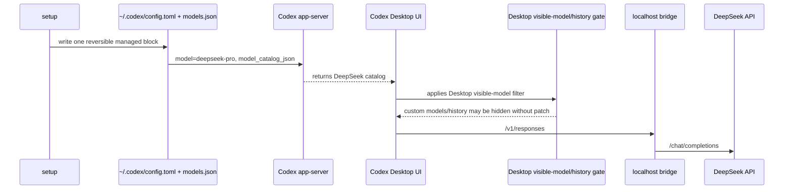

English | [简体中文](./README.zh-CN.md)

<div align="center">

  <h1>Codex DeepSeek Bridge</h1>

  <p><strong>Run the OpenAI Codex app on DeepSeek.</strong></p>
  <p>One command sets it up. No ChatGPT subscription needed.<br>Your Codex, your DeepSeek key, your machine.</p>

  <br>

  <p>
    <a href="#quick-start">
      
    </a>
  </p>

  <p>
    
    
    
    
  </p>

  <p><sub>
    Keep the Codex app you already use — approvals, plugins, MCP servers, your whole workflow stay put — but send every model call to DeepSeek.<br>
    No fork, no proxy account, no telemetry. When you want out, a single <code>restore</code> puts everything back.
  </sub></p>

</div>

<br>


`setup` writes one reversible block into Codex's own `config.toml`, points it at a bridge on
`127.0.0.1`, and the bridge talks to DeepSeek on the other side. No forked app, no account juggling.

## Requirements

- A DeepSeek API key from [platform.deepseek.com](https://platform.deepseek.com).
- The Codex app on macOS or Windows.

## Quick Start

> **Copy the commands below, run them, then restart Codex.** That is the whole install — no build step, and Node is not required.

### macOS Apple Silicon

```bash
curl -L -o codex-deepseek-bridge-macos https://github.com/JetXu-LLM/codex-deepseek-bridge/releases/latest/download/codex-deepseek-bridge-macos
xattr -d com.apple.quarantine ./codex-deepseek-bridge-macos 2>/dev/null || true
chmod +x ./codex-deepseek-bridge-macos
./codex-deepseek-bridge-macos setup
```

### macOS Intel

```bash
curl -L -o codex-deepseek-bridge-macos-x64 https://github.com/JetXu-LLM/codex-deepseek-bridge/releases/latest/download/codex-deepseek-bridge-macos-x64
xattr -d com.apple.quarantine ./codex-deepseek-bridge-macos-x64 2>/dev/null || true
chmod +x ./codex-deepseek-bridge-macos-x64
./codex-deepseek-bridge-macos-x64 setup
```

### Windows PowerShell

```powershell
$ErrorActionPreference = "Stop"
$url = "https://github.com/JetXu-LLM/codex-deepseek-bridge/releases/latest/download/codex-deepseek-bridge-win-x64.exe"
$out = ".\codex-deepseek-bridge-win-x64.exe"
Remove-Item $out -ErrorAction SilentlyContinue
curl.exe -L --fail --progress-bar -o $out $url
if ($LASTEXITCODE -ne 0) { throw "Download failed." }
if ((Get-Item $out).Length -lt 10MB) { throw "Download looks incomplete. Run the commands again." }
& $out setup
```

`setup` asks for your DeepSeek API key in the terminal. It is not echoed, printed, logged, or taken
as a command-line argument. When setup finishes it prints a short summary — what was configured,
which models are published, and any action you still need to take — then you restart Codex.
If Codex Desktop is not installed yet, `setup` can install the official app first and continue.
If a newer bridge release is available, `setup` asks before upgrading and keeps your stored key, logs, and report data.

Setup saves the Codex config, but Codex can use DeepSeek only while the local bridge process is
running. If you restart your computer or Codex can no longer reach DeepSeek, run `start` with the
same command style you used for setup, for example `codex-deepseek-bridge start`,
`./codex-deepseek-bridge-macos start`, or `.\codex-deepseek-bridge-win-x64.exe start`.
You usually do not need `setup` again unless you want to reconfigure the bridge or change your
DeepSeek key.

By default this keeps Codex on `deepseek-pro`. The composer shows `Custom` next to your reasoning
effort (the screenshot up top is `deepseek-pro` running at max thinking) because current Codex Desktop
builds do not render custom model names yet. Want both models with their real labels? See
[Show both models in the picker](#show-both-models-in-the-picker-opt-in) below.

Reasoning effort maps straight through to DeepSeek: **Extra High** (and `max`) run `deepseek-pro` at
maximum thinking, **High** is the middle setting, and **None** turns thinking off.

Setup is safe to run again. If you start with `setup` and later want the full picker, run
`setup --desktop-patch`; the bridge rewrites the same managed block instead of duplicating config.

## Why this exists

- 🧩 **Your Codex stays your Codex.** Approvals, plugins, skills, and MCP servers keep working; common plugin tool-name slips are repaired before Codex sees them.
- 🔒 **Your key stays local.** Read from stdin, stored with owner-only permissions, never printed, logged, or passed as an argument. No telemetry.
- 📊 **You see every call.** A local, read-only [report](#the-local-report) shows tokens, latency, DeepSeek cache hits, and raw request/response JSON.
- 🎯 **Cache visibility, not silent edits.** It flags when your prompt prefix drifts and stops hitting DeepSeek's cache. It reports the problem; it never rewrites your prompts.
- 🖼️ **Ready for multimodal.** A vision seam is already wired in; when DeepSeek ships image input it is a config flag, not a rewrite.
- ↩️ **One command out.** `restore` removes the managed block and stops the bridge; `restore --purge` clears everything, key included.

> **Plugins work today.** Browser, Chrome, Computer Use, MCP, and document-style plugins can stay in
> Codex while DeepSeek handles the model calls. If that unlocks a cheaper Codex workflow for you,
> please **Star** the repo so more users can find it.

## Show both models in the picker (opt-in)

Config-only setup publishes `deepseek-pro`. To get **both** `deepseek-pro` and `deepseek-flash` with
their real labels in the picker, opt in to the Desktop patch:

```bash
./codex-deepseek-bridge-macos setup --desktop-patch
```

> **User choice.** `--desktop-patch` modifies the official Codex app installed on your machine,
> including its code bundle and signature; run it only if you choose to make that local change yourself.


**Why it is needed.** Current Codex Desktop builds load `model_catalog_json` on the app-server side,
but the renderer filters custom models out of the visible picker
([openai/codex#19694](https://github.com/openai/codex/issues/19694),
[openai/codex#29156](https://github.com/openai/codex/issues/29156)). The patch edits your local Codex
app files so the picker honors the local catalog. It does not download or distribute a modified Codex.

- **macOS:** patches `Codex.app/Contents/Resources/app.asar`, updates ASAR integrity, and re-signs the local bundle.
- **Windows (writable install):** patches `resources/app.asar` after backing it up.
- **Windows (Store install):** builds a writable managed copy under the bridge state directory and prints a launcher to open it. *(Treat Windows `--desktop-patch` as experimental.)*

**What is worth knowing up front:**

- **macOS App Management.** macOS guards changes to apps in `/Applications`. The first run may need
  System Settings &rarr; Privacy &amp; Security &rarr; **App Management** turned on for your terminal.
  `sudo` does not satisfy this — if the patch reports "not writable," that is usually what it means.
- **Keychain prompts.** Re-signing the bundle locally changes its signature, so macOS may ask to
  allow Keychain access when Codex launches. Click **Always Allow**. Reinstalling or updating Codex
  restores Apple's original signature. Plain `setup` does not re-sign Codex.app.
- **Reversible.** `restore` undoes the patch and stops the bridge.

```bash
codex-deepseek-bridge restore
```

If you ran a downloaded binary that is not on your `PATH`, call it the same way, for example
`./codex-deepseek-bridge-macos restore`. Normal `restore` keeps your key, logs, and backups so you can
re-run setup without pasting the key again. For a full local cleanup, use `restore --purge`.

## The local report

Every call runs through the bridge, so you can see exactly what Codex is doing on DeepSeek.


Run `codex-deepseek-bridge report` to open it at `http://localhost:8787/report`. It is read-only,
offline, and bound to `127.0.0.1`:

- Tokens, latency, and per-model totals for every call.
- DeepSeek **cache hit rate** plus a **prefix-risk** read on how stable your cached prompt prefix is.
- A per-call detail view with a raw JSON link for prompt/request/response payloads. Disable payload
  logs with `DSCB_LOG_PAYLOADS=0` or `--no-log-payloads` if you need metadata-only logging.
  These logs are the ground truth for future DeepSeek cache-matching work.

## How it works

Codex officially supports user-level provider configuration, `model_provider`, `model_providers`,
`openai_base_url`, and `model_catalog_json` in `~/.codex/config.toml`. See the OpenAI Codex docs:
[configuration reference](https://developers.openai.com/codex/config-reference#configtoml),
[custom model providers](https://developers.openai.com/codex/config-advanced#custom-model-providers),
and [OSS mode local providers](https://developers.openai.com/codex/config-advanced#oss-mode-local-providers).



`setup --desktop-patch` changes only local Desktop renderer files. Model calls still go through the
local bridge and then to DeepSeek.

## Login and history

`setup` does not replace your Codex login.

- ChatGPT login stays ChatGPT.
- API-key login stays API-key.
- Existing non-reserved provider history is reused when possible.
- The reserved `openai` provider is not redefined; current setup uses the independent
  `deepseek_bridge` provider for that case.

ChatGPT cloud history still requires a ChatGPT sign-in. Local history can be scoped by Codex
provider id, so `restore` is the reliable way to return to the exact previous setup.

| Before setup | While DeepSeek is active | After `restore` |
| --- | --- | --- |
| ChatGPT/OpenAI provider | ChatGPT cloud history needs the ChatGPT sign-in; local OpenAI-provider chats may be hidden while DeepSeek uses its own provider id | Previous ChatGPT/OpenAI setup returns |
| Existing custom/API-key provider such as `codex` | Setup may reuse that provider id so those local chats stay visible, now routed through DeepSeek | Previous provider config returns |
| No reusable provider history | DeepSeek uses its own `deepseek_bridge` provider; other provider histories are unchanged but may be hidden | Previous config returns |

## Daily use

```bash
codex-deepseek-bridge doctor        # is the bridge healthy and configured?
codex-deepseek-bridge doctor --live # make one real DeepSeek call, end to end
codex-deepseek-bridge report        # open the local report
codex-deepseek-bridge start         # start the local bridge again if needed
codex-deepseek-bridge restore       # put Codex back the way it was
```

On macOS, `doctor` also flags the signature and Keychain situation when the Desktop patch left Codex
locally signed, so you know when `restore` can use bridge backups or when reinstalling/updating
Codex is needed to quiet the launch prompts.

## Privacy and responsibility

- The bridge sends model requests to DeepSeek.
- It stores your DeepSeek key locally with owner-only permissions.
- It can optionally check GitHub releases for updates and asks before installing one.
- It does not upload telemetry.
- It does not distribute a modified Codex app.

The optional Desktop patch modifies local Codex Desktop app files on your machine. Review your own
legal, workplace, and contract obligations before using it. This project is provided under
Apache-2.0 without warranty and is not affiliated with OpenAI or DeepSeek.

## Install with npm

Prefer a global command and already have Node? Installing with npm puts `codex-deepseek-bridge` on
your `PATH`, so you can drop the `./codex-deepseek-bridge-macos` prefix and just run
`codex-deepseek-bridge`:

```bash
npm install -g github:JetXu-LLM/codex-deepseek-bridge
codex-deepseek-bridge setup
```

## Docs

- [FAQ](docs/faq.md)
- [Architecture](docs/architecture.md)
- [Configuration and platforms](docs/platforms-and-upgrades.md)
- [Cache and the report](docs/cache-and-observability.md)
- [Privacy and network](docs/privacy-and-network.md)
- [Troubleshooting](docs/troubleshooting.md)
- [Security](SECURITY.md)

## License

Apache License 2.0. See [LICENSE](LICENSE).
