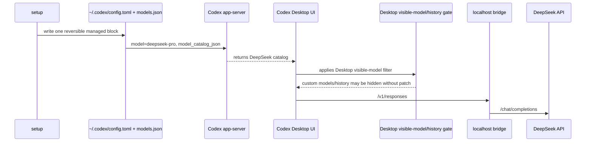

# Codex DeepSeek Bridge

Use DeepSeek inside the OpenAI Codex app through a tiny local Responses-compatible bridge.

By default, setup uses Codex's official config path and publishes `deepseek-pro`. If you explicitly
opt in to the Desktop compatibility patch, Codex also shows `deepseek-flash` in the model picker and
keeps provider-scoped local history visible in more Desktop builds.

## Quick Start

### macOS Apple Silicon

```bash
curl -L -o codex-deepseek-bridge-macos https://github.com/JetXu-LLM/codex-deepseek-bridge/releases/latest/download/codex-deepseek-bridge-macos
xattr -d com.apple.quarantine ./codex-deepseek-bridge-macos 2>/dev/null || true
chmod +x ./codex-deepseek-bridge-macos
./codex-deepseek-bridge-macos setup
```

### macOS Intel

```bash
curl -L -o codex-deepseek-bridge-macos-x64 https://github.com/JetXu-LLM/codex-deepseek-bridge/releases/latest/download/codex-deepseek-bridge-macos-x64
xattr -d com.apple.quarantine ./codex-deepseek-bridge-macos-x64 2>/dev/null || true
chmod +x ./codex-deepseek-bridge-macos-x64
./codex-deepseek-bridge-macos-x64 setup
```

### Windows PowerShell

```powershell
Invoke-WebRequest -Uri "https://github.com/JetXu-LLM/codex-deepseek-bridge/releases/latest/download/codex-deepseek-bridge-win-x64.exe" -OutFile ".\codex-deepseek-bridge-win-x64.exe"
.\codex-deepseek-bridge-win-x64.exe setup
```

`setup` asks for your DeepSeek API key in the terminal. The key is not echoed, printed, logged, or
accepted as a command-line argument. After setup finishes, restart Codex.

Config-only setup keeps Codex on `deepseek-pro`; the picker may show `Custom` until Codex Desktop
fixes custom catalog rendering.

You can safely run setup again. For example, if you first ran `setup` and later decide you want the
Desktop picker, run `setup --desktop-patch`; the bridge rewrites the same managed block and updates
the catalog instead of duplicating config.

## Desktop Compatibility Patch

Current Codex Desktop builds can load `model_catalog_json` on the app-server side while the Desktop
renderer still filters custom models out of the visible picker. This is tracked in
[openai/codex#19694](https://github.com/openai/codex/issues/19694). A related open issue for custom
providers, existing chats, and the Desktop picker is
[openai/codex#29156](https://github.com/openai/codex/issues/29156).

The Desktop compatibility patch is an explicit local workaround. It modifies your local Codex
Desktop app files so the picker honors the local catalog and the recent-thread list is not narrowed
to the previous provider. It does not distribute a modified Codex app.


The screenshot above requires:

```bash
./codex-deepseek-bridge-macos setup --desktop-patch
```

- macOS: patches `Codex.app/Contents/Resources/app.asar`, updates Electron ASAR integrity, and
  re-signs the local app bundle.
- Windows writable installs: patches `resources/app.asar` after backing it up.
- Windows Store installs: creates a writable managed Codex copy under the bridge state directory and
  prints a launcher path. Use that launcher to open the patched copy.

Restore your previous Codex setup and stop the bridge with:

```bash
codex-deepseek-bridge restore
```

If you used a downloaded binary and did not install it on your PATH, run the same binary with
`restore`, for example `./codex-deepseek-bridge-macos restore`.

Normal `restore` keeps the stored DeepSeek key, logs, and backups so setup can be re-run without
pasting the key again. For a full local cleanup, use:

```bash
codex-deepseek-bridge restore --purge
```

## What Happens

Codex officially supports user-level provider configuration, `model_provider`, `model_providers`,
`openai_base_url`, and `model_catalog_json` in `~/.codex/config.toml`. See the OpenAI Codex docs:
[configuration reference](https://developers.openai.com/codex/config-reference#configtoml),
[custom model providers](https://developers.openai.com/codex/config-advanced#custom-model-providers),
and [OSS mode local providers](https://developers.openai.com/codex/config-advanced#oss-mode-local-providers).



`setup --desktop-patch` changes only local Desktop renderer files. Model calls still go through the
local bridge and then to DeepSeek.

## Login And History

`setup` does not replace your Codex login.

- ChatGPT login stays ChatGPT.
- API-key login stays API-key.
- Existing non-reserved provider history is reused when possible.
- The reserved `openai` provider uses the official `openai_base_url` override instead of redefining
  `[model_providers.openai]`.

ChatGPT cloud history still requires a ChatGPT sign-in. Local history can be scoped by Codex
provider id, so `restore` is the reliable way to return to the exact previous setup.

## Daily Use

```bash
codex-deepseek-bridge doctor
codex-deepseek-bridge doctor --live
codex-deepseek-bridge report
codex-deepseek-bridge restore
```

`report` starts the bridge if needed and opens the local report in your browser:

```text
http://localhost:8787/report
```

The bridge binds to the local loopback interface (`127.0.0.1`) and uploads no telemetry.

## Privacy And Responsibility

- The bridge sends model requests to DeepSeek.
- It stores your DeepSeek key locally with owner-only permissions.
- It can optionally check GitHub releases for updates.
- It does not upload telemetry.
- It does not distribute a modified Codex app.

The optional Desktop patch modifies local Codex Desktop app files on your machine. Review your own
legal, workplace, and contract obligations before using it. This project is provided under
Apache-2.0 without warranty and is not affiliated with OpenAI or DeepSeek.

## Node Install

If you prefer a global command and already have Node:

```bash
npm install -g github:JetXu-LLM/codex-deepseek-bridge
codex-deepseek-bridge setup
```

## Docs

- [Architecture](docs/architecture.md)
- [Configuration and platforms](docs/platforms-and-upgrades.md)
- [Cache and the report](docs/cache-and-observability.md)
- [Privacy and network](docs/privacy-and-network.md)
- [Troubleshooting](docs/troubleshooting.md)
- [Security](SECURITY.md)

## License

Apache License 2.0. See [LICENSE](LICENSE).
