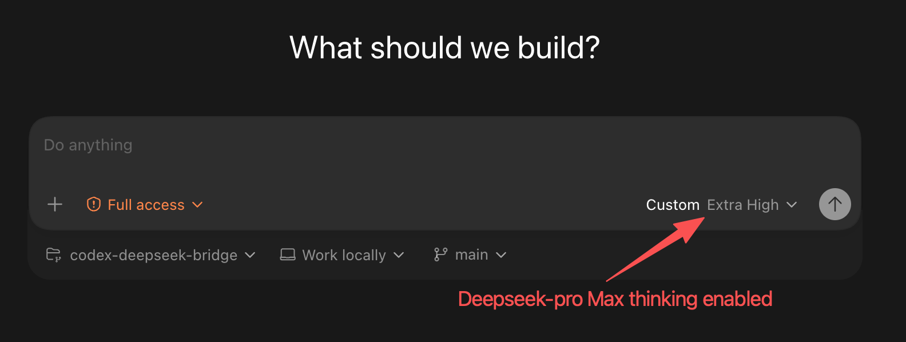
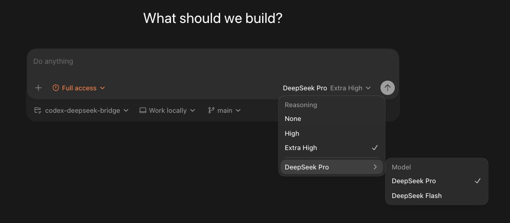
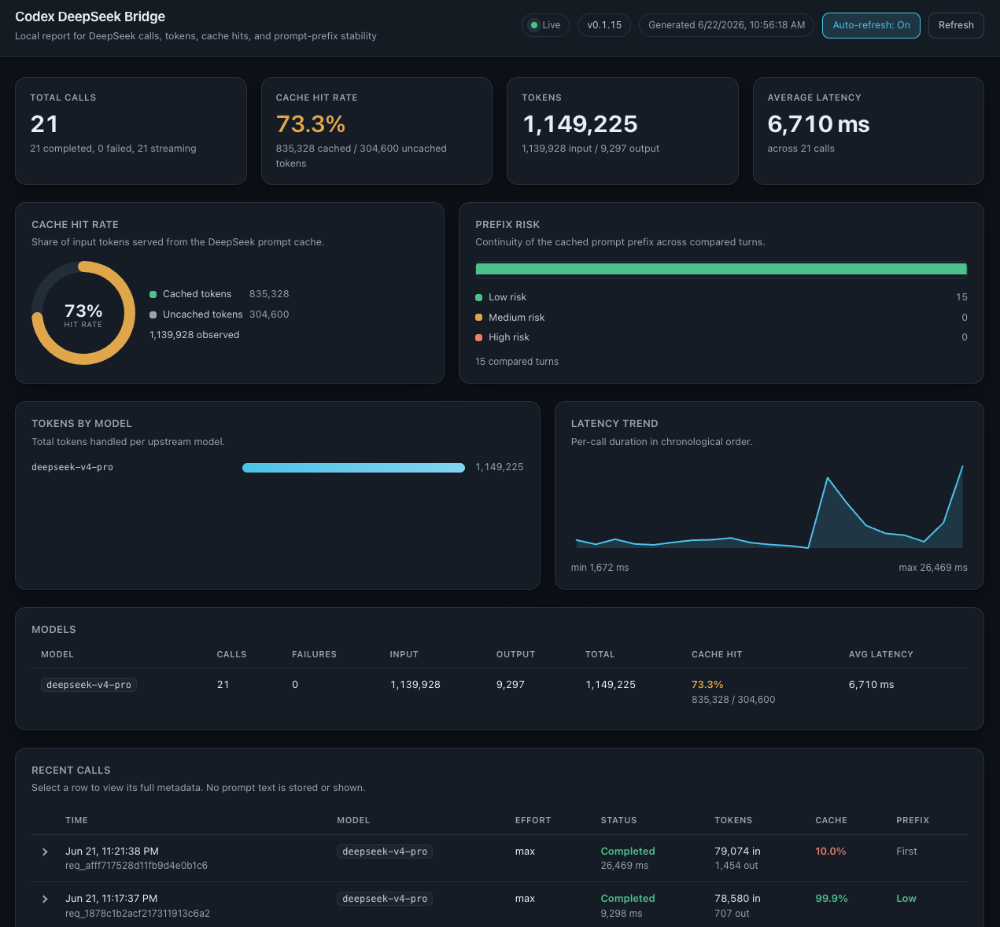
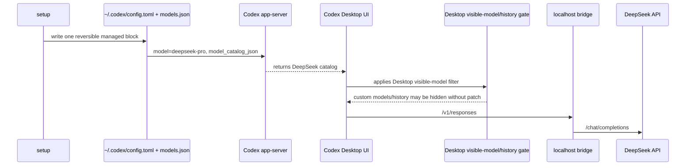

[English](./README.md) | 简体中文

> 本中文 README 尽量与英文版保持同步。若两者存在差异，请以英文版为准。

<div align="center">

  <h1>Codex DeepSeek Bridge</h1>

  <p><strong>让 OpenAI Codex app 使用 DeepSeek。</strong></p>
  <p>一条命令完成设置。后面的工作由一个很小的本地 bridge 接管。<br>你的 Codex、你的 DeepSeek key、你的机器。</p>

  <br>

  <p>
    <a href="#快速开始">
      
    </a>
  </p>

  <p>
    
    
    
    
  </p>

  <p><sub>
    继续使用你已经在用的 Codex app：approvals、plugins、MCP servers 和整套工作流都保留，只是把每次模型调用发给 DeepSeek。<br>
    不 fork app，不需要代理账号，不上传 telemetry。想退出时，一条 <code>restore</code> 就能恢复。
  </sub></p>

</div>

<br>



`setup` 会在 Codex 自己的 `config.toml` 里写入一个可恢复的配置块，把 Codex 指向
`127.0.0.1` 上的本地 bridge；bridge 再把请求转给 DeepSeek。不需要 fork app，也不需要来回切账号。

## 需求

- 一个来自 [platform.deepseek.com](https://platform.deepseek.com) 的 DeepSeek API key。
- macOS 或 Windows 上的 Codex app。

## 快速开始

> **复制下面的命令并运行，然后重启 Codex。** 这就是完整安装过程，不需要 build，也不需要 Node。

### macOS Apple Silicon

```bash
curl -L -o codex-deepseek-bridge-macos https://github.com/JetXu-LLM/codex-deepseek-bridge/releases/latest/download/codex-deepseek-bridge-macos
xattr -d com.apple.quarantine ./codex-deepseek-bridge-macos 2>/dev/null || true
chmod +x ./codex-deepseek-bridge-macos
./codex-deepseek-bridge-macos setup
```

### macOS Intel

```bash
curl -L -o codex-deepseek-bridge-macos-x64 https://github.com/JetXu-LLM/codex-deepseek-bridge/releases/latest/download/codex-deepseek-bridge-macos-x64
xattr -d com.apple.quarantine ./codex-deepseek-bridge-macos-x64 2>/dev/null || true
chmod +x ./codex-deepseek-bridge-macos-x64
./codex-deepseek-bridge-macos-x64 setup
```

### Windows PowerShell

```powershell
Invoke-WebRequest -Uri "https://github.com/JetXu-LLM/codex-deepseek-bridge/releases/latest/download/codex-deepseek-bridge-win-x64.exe" -OutFile ".\codex-deepseek-bridge-win-x64.exe"
.\codex-deepseek-bridge-win-x64.exe setup
```

`setup` 会在 terminal 里要求你输入 DeepSeek API key。这个 key 不会被回显、打印、记录日志，
也不会作为命令行参数传入。设置完成后，它会打印一段简短摘要：配置了什么、发布了哪些模型、
以及你还需要做什么。然后你重启 Codex。
如果有更新的 bridge 版本，`setup` 会先询问是否升级，并保留你本机保存的 key、日志和 report 数据。

默认情况下，Codex 会使用 `deepseek-pro`。当前 Codex Desktop 还不会在界面里渲染 custom model
的真实名字，所以 composer 会在 reasoning effort 旁边显示 `Custom`。上面的截图就是
`deepseek-pro` 使用最大 thinking 的状态。想让两个模型都用真实名字出现在选择器里？看下面的
[在模型选择器里显示两个模型](#在模型选择器里显示两个模型可选)。

Reasoning effort 会直接映射到 DeepSeek：**Extra High**（以及 `max`）会让 `deepseek-pro`
使用最大 thinking，**High** 是中间档，**None** 会关闭 thinking。

`setup` 可以重复运行。如果你先运行了普通 `setup`，之后又想启用完整模型选择器，可以运行
`setup --desktop-patch`；bridge 会重写同一个受管理配置块，不会重复写入配置。

## 为什么做这个

- 🧩 **你的 Codex 还是你的 Codex。** Approvals、plugins、skills 和 MCP servers 会继续工作；常见的 plugin tool-name 小偏差会在 Codex 看到之前被修正。
- 🔒 **你的 key 留在本机。** 从 stdin 读取，按 owner-only 权限保存，不打印、不记录、不作为参数传递。没有 telemetry。
- 📊 **你能看到每次调用。** 本地只读 [report](#本地-report) 会显示 tokens、latency、DeepSeek cache hits，以及原始 request/response JSON。
- 🎯 **看见 cache，而不是偷偷改 prompt。** 它会提示 prompt prefix 什么时候开始漂移、什么时候不再命中 DeepSeek cache。它只报告问题，不改写你的 prompt。
- 🖼️ **为 multimodal 预留。** Vision 路径已经接好；等 DeepSeek 支持 image input 时，这是一个 config flag，不是一次重写。
- ↩️ **一条命令退出。** `restore` 会移除受管理配置块并停止 bridge；`restore --purge` 会清掉所有本地状态，包括 key。

## 在模型选择器里显示两个模型（可选）

只用配置的 setup 会发布 `deepseek-pro`。如果你想在 picker 里看到 **`deepseek-pro`** 和
**`deepseek-flash`** 两个模型，并显示真实名字，可以选择启用 Desktop patch：

```bash
./codex-deepseek-bridge-macos setup --desktop-patch
```

> **用户自行选择。** `--desktop-patch` 会修改你本机安装的官方 Codex app，
> 包括它的 code bundle 和签名；只有在你自己决定做这个本地修改时才运行它。



**为什么需要它。** 当前 Codex Desktop 会在 app-server 侧加载 `model_catalog_json`，
但 renderer 会把 custom models 从可见 picker 里过滤掉
([openai/codex#19694](https://github.com/openai/codex/issues/19694),
[openai/codex#29156](https://github.com/openai/codex/issues/29156))。这个 patch 会修改你本地的
Codex app 文件，让 picker 尊重本地 catalog。它不会下载或分发修改版 Codex。

- **macOS:** patch `Codex.app/Contents/Resources/app.asar`，更新 ASAR integrity，并重新签名本地 bundle。
- **Windows（可写安装）:** 备份后 patch `resources/app.asar`。
- **Windows（Store 安装）:** 在 bridge state 目录下创建一个可写的受管理副本，并打印一个 launcher 用来打开它。*请把 Windows `--desktop-patch` 当作实验功能。*

**提前知道这些会更省事：**

- **macOS App Management。** macOS 会保护 `/Applications` 里的 app。第一次运行可能需要到
  System Settings &rarr; Privacy &amp; Security &rarr; **App Management**，给你的 terminal 打开权限。
  `sudo` 不能解决这个问题；如果 patch 报 "not writable"，通常就是这里没开。
- **Keychain prompts。** 本地重新签名会改变 bundle 签名，所以 Codex 启动时 macOS 可能会要求你允许
  Keychain 访问。点 **Always Allow**。重装或更新 Codex 会恢复 Apple 原始签名。普通 `setup`
  不会重新签名 Codex.app。
- **可恢复。** `restore` 会撤销这个 patch 并停止 bridge。

```bash
codex-deepseek-bridge restore
```

如果你运行的是下载下来的 binary，并且它不在 `PATH` 里，就用同样的方式调用它，例如
`./codex-deepseek-bridge-macos restore`。普通 `restore` 会保留你的 key、logs 和 backups，
这样下次 setup 不需要重新粘贴 key。想做完整本地清理，用 `restore --purge`。

## 本地 report

每次调用都会经过 bridge，所以你可以清楚看到 Codex 到底在 DeepSeek 上做了什么。



运行 `codex-deepseek-bridge report`，它会在 `http://localhost:8787/report` 打开。这个页面只读、
离线，并且绑定在 `127.0.0.1`：

- 每次调用的 tokens、latency 和按模型统计的 totals。
- DeepSeek **cache hit rate**，以及一个 **prefix-risk** 判断，用来看 cached prompt prefix 是否稳定。
- 每次调用都有 detail view，并提供 raw JSON 链接，可以查看 prompt/request/response payloads。
  如果你只想记录 metadata，可以用 `DSCB_LOG_PAYLOADS=0` 或 `--no-log-payloads` 关闭 payload logs。
  这些 logs 是后续优化 DeepSeek cache matching 的真实依据。

## 工作原理

Codex 官方支持在 `~/.codex/config.toml` 里配置 user-level provider，包括 `model_provider`、
`model_providers`、`openai_base_url` 和 `model_catalog_json`。可以参考 OpenAI Codex 文档：
[configuration reference](https://developers.openai.com/codex/config-reference#configtoml)、
[custom model providers](https://developers.openai.com/codex/config-advanced#custom-model-providers)、
以及 [OSS mode local providers](https://developers.openai.com/codex/config-advanced#oss-mode-local-providers)。



`setup --desktop-patch` 只修改本地 Desktop renderer 文件。模型调用仍然是 Codex 到本地 bridge，
再由本地 bridge 转给 DeepSeek。

## 登录和历史记录

`setup` 不会替换你的 Codex 登录。

- ChatGPT login 仍然是 ChatGPT。
- API-key login 仍然是 API-key。
- 如果已有 non-reserved provider history，会尽量复用。
- 保留的 `openai` provider 会使用官方 `openai_base_url` override，而不是重新定义
  `[model_providers.openai]`。

ChatGPT cloud history 仍然需要 ChatGPT sign-in。Codex 的 local history 可能按 provider id
分组，所以 `restore` 是回到原设置最可靠的方式。

| setup 前 | DeepSeek 启用期间 | `restore` 后 |
| --- | --- | --- |
| ChatGPT/OpenAI provider | ChatGPT cloud history 需要 ChatGPT sign-in；如果 setup 复用了另一个 provider id，本地 OpenAI-provider chats 可能暂时隐藏 | 恢复之前的 ChatGPT/OpenAI 设置 |
| 已有 custom/API-key provider，例如 `codex` | setup 可能复用这个 provider id，所以这些 local chats 仍然可见，只是现在路由到 DeepSeek | 恢复之前的 provider config |
| 没有可复用的 provider history | DeepSeek 使用自己的 `deepseek_bridge` provider；其他 provider 的 histories 不会被改动，但可能暂时隐藏 | 恢复之前的 config |

## 日常使用

```bash
codex-deepseek-bridge doctor        # 检查 bridge 是否健康、配置是否有效
codex-deepseek-bridge doctor --live # 做一次真实 DeepSeek 调用，端到端检查
codex-deepseek-bridge report        # 打开本地 report
codex-deepseek-bridge restore       # 把 Codex 恢复到之前的状态
```

在 macOS 上，如果 Desktop patch 让 Codex 处于本地签名状态，`doctor` 也会提示签名和 Keychain
情况。这样你能知道 `restore` 是否可以用 bridge backups 恢复，还是需要重装/更新 Codex 来消除启动提示。

## 隐私和责任

- bridge 会把模型请求发送给 DeepSeek。
- 它会把你的 DeepSeek key 以 owner-only 权限保存在本机。
- 它可以选择性检查 GitHub releases 是否有更新，并会先询问再安装更新。
- 它不会上传 telemetry。
- 它不会分发修改版 Codex app。

可选的 Desktop patch 会修改你本机的 Codex Desktop app 文件。使用前，请自行确认你的法律、
工作场所和合同义务。这个项目使用 Apache-2.0 license，不提供 warranty，也不隶属于 OpenAI 或 DeepSeek。

## 使用 npm 安装

如果你更喜欢全局命令，并且已经有 Node，可以用 npm 安装。这样 `codex-deepseek-bridge`
会进入你的 `PATH`，之后就不用写 `./codex-deepseek-bridge-macos` 前缀了：

```bash
npm install -g github:JetXu-LLM/codex-deepseek-bridge
codex-deepseek-bridge setup
```

## 文档

- [Architecture](docs/architecture.md)
- [Configuration and platforms](docs/platforms-and-upgrades.md)
- [Cache and the report](docs/cache-and-observability.md)
- [Privacy and network](docs/privacy-and-network.md)
- [Troubleshooting](docs/troubleshooting.md)
- [Security](SECURITY.md)

## License

Apache License 2.0. See [LICENSE](LICENSE).
