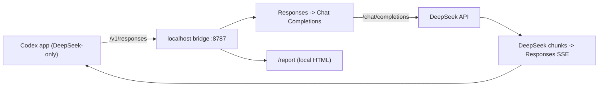

# Architecture

Codex DeepSeek Bridge turns the OpenAI Codex app into a DeepSeek-only coding agent. Codex talks to a
tiny local Responses-compatible server; the server translates to DeepSeek `/chat/completions` and
back. One process serves the bridge and the local report.

## Components

- `bin/codex-deepseek-bridge.mjs` — the CLI (`setup`, `start`, `report`, `doctor`, `restore`,
  `upgrade`, `version`, `status`, `stop`, internal `serve`).
- `src/server.mjs` — the localhost HTTP server and routes.
- `src/translate.mjs` — Responses ⇄ Chat Completions translation, tools, streaming, usage.
- `src/models.mjs` — the two Codex-facing slugs and their upstream mapping.
- `src/catalog.mjs` — the two-model catalog and the managed `config.toml` block.
- `src/install.mjs` — config writer, key storage, login detect-and-adapt, install state, restore.
- `src/report.mjs` / `src/prompt-diagnostics.mjs` — the local report and cache diagnostics.
- `src/update-check.mjs` / `src/upgrade.mjs` / `src/version.mjs` — version, update check, upgrade.

## Request flow



The server binds `127.0.0.1:8787` and serves:

- `POST /v1/responses` and `POST /responses`
- `GET /v1/models` and `GET /models` — the two-model catalog
- `GET /health` — liveness, version, and port
- `GET /report` and `GET /report/data` — the local usage and cache report

## The generated Codex config

`setup` writes one managed block at the top of `~/.codex/config.toml` (`%USERPROFILE%\.codex` on
Windows), after backing up any existing file:

```toml
# >>> codex-deepseek-bridge
# Managed by codex-deepseek-bridge. Run `codex-deepseek-bridge restore` to undo.
model = "deepseek-pro"
model_provider = "deepseek_bridge"
model_catalog_json = "<bridgeHome>/models.json"
model_reasoning_effort = "high"

[model_providers.deepseek_bridge]
name = "DeepSeek (via Codex DeepSeek Bridge)"
base_url = "http://127.0.0.1:8787/v1"
wire_api = "responses"
requires_openai_auth = false
# <<< codex-deepseek-bridge
```

`<bridgeHome>` defaults to `<CODEX_HOME>/codex-deepseek-bridge`. It also holds `models.json`,
`deepseek-key`, `install-state.json`, and the daemon's pid and logs.

## Models and reasoning

The picker shows exactly two slugs. Each maps to a configurable upstream model:

| Codex slug | Upstream model (configurable) |
| --- | --- |
| `deepseek-pro` | `deepseek-v4-pro` (`DEEPSEEK_MODEL_PRO`) |
| `deepseek-flash` | `deepseek-v4-flash` (`DEEPSEEK_MODEL_FLASH`) |

The Codex-facing slugs never change; only the upstream mapping does when DeepSeek ships a new
generation. Unknown or dated slugs fold to the nearest known slug so old sessions keep working.

`models.json` carries both Codex CLI catalog fields (`slug`, `display_name`,
`default_reasoning_level`, `supported_reasoning_levels`) and Codex desktop app-server fields
(`model`, `displayName`, `defaultReasoningEffort`, `supportedReasoningEfforts`). `deepseek-pro` has
the first catalog priority so the desktop app keeps it as the default after app-server sorting.

Each model exposes three reasoning efforts:

| Codex effort | DeepSeek request |
| --- | --- |
| `none` | `thinking: { type: "disabled" }` |
| `high` (default) | `thinking: { type: "enabled" }`, `reasoning_effort: "high"` |
| `xhigh` | `thinking: { type: "enabled" }`, `reasoning_effort: "max"` |

Any other effort folds to the nearest of the three (`minimal`→`none`; `low`/`medium`→`high`;
`max`→`xhigh`).

## Key resolution

At request time the bridge resolves the DeepSeek key in this order:

1. `DEEPSEEK_API_KEY` in the bridge process.
2. The stored key file `<bridgeHome>/deepseek-key`.
3. A forwarded bearer, for older configs that still set `requires_openai_auth = true`.

If `DSCB_BRIDGE_API_KEY` is set (advanced, for exposing the bridge beyond localhost), the incoming
bearer gates the bridge and the upstream key must come from steps 1–2.

## Tool calls and reasoning state

- Codex freeform custom tools (such as `apply_patch`) wrap as `{ "input": "..." }` upstream and
  unwrap to a Codex `custom_tool_call`.
- Function and namespace tools pass through.
- DeepSeek thinking returns `reasoning_content`; the bridge carries it as opaque Codex reasoning
  state for multi-turn continuity. It is compatibility state, not encryption.
- Usage mapping includes DeepSeek cache fields and `input_tokens_details.cached_tokens`.
