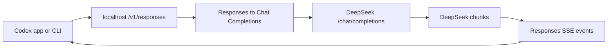

# Architecture

Codex DeepSeek Bridge has seven small components:

1. `bin/codex-deepseek-bridge.mjs`: CLI entrypoint.
2. `src/server.mjs`: localhost HTTP server and Responses-compatible routes.
3. `src/translate.mjs`: protocol translation between OpenAI Responses and DeepSeek Chat Completions.
4. `src/models.mjs`: Codex-facing model presets and DeepSeek upstream mapping.
5. `src/install.mjs`: Codex model catalog and profile generation.
6. `src/report.mjs`: local HTML report and report JSON.
7. `src/prompt-diagnostics.mjs`: prompt-prefix hashes used for cache diagnostics.

## Request Flow



## Authentication Flow

Profile Mode and App Login Mode use different key paths:

- Profile Mode: the bridge process reads `DEEPSEEK_API_KEY` and uses it for DeepSeek upstream requests. Codex login remains unchanged.
- App Login Mode: Codex stores a DeepSeek key through Codex API-key auth. The active provider points at `localhost`, so Codex sends that bearer token to the bridge. If `DEEPSEEK_API_KEY` is not set, the bridge uses the bearer token as the DeepSeek upstream key.

If `DSCB_BRIDGE_API_KEY` is configured, the bearer token is treated as local bridge authentication instead. In that case the bridge still needs `DEEPSEEK_API_KEY` for upstream DeepSeek calls.

## Tool Calls

Codex custom tools can be freeform. DeepSeek Chat Completions function tools need JSON arguments. The bridge wraps freeform input as:

```json
{ "input": "raw tool input" }
```

On the way back, it unwraps that object and emits a Codex `custom_tool_call`.

## Reasoning State

DeepSeek thinking mode returns `reasoning_content`. Codex expects reasoning items to be carried as opaque state. The bridge encodes the DeepSeek reasoning content into the `encrypted_content` field with a local prefix. It is not encryption; it is compatibility state for multi-turn continuity.

## Model Mapping

The bridge exposes model names that Codex users can understand:

- `deepseek-v4-pro` -> upstream `deepseek-v4-pro`
- `deepseek-v4-flash` -> upstream `deepseek-v4-flash`
- `deepseek-v4-pro-no-thinking` -> upstream `deepseek-v4-pro` with `thinking.disabled`
- `deepseek-v4-flash-no-thinking` -> upstream `deepseek-v4-flash` with `thinking.disabled`

For thinking-enabled models, Codex `high` maps to DeepSeek `high`, and Codex `xhigh` / `max` maps to DeepSeek `max`. Codex `low` and `medium` are intentionally folded into DeepSeek `high`, matching DeepSeek's compatibility behavior.

## Cache Observability

DeepSeek KV cache is upstream behavior. The bridge records usage cache fields when present:

- `prompt_cache_hit_tokens`
- `prompt_cache_miss_tokens`
- `cache_read_input_tokens`

Those fields appear in `calls.jsonl`. Metadata logs default to `~/.codex/codex-deepseek-bridge/logs`; set `DSCB_LOG_DIR=off` to disable them.

The local report is served at `/report` and reads the same JSONL data. It shows:

- token totals by model
- cache hit and miss tokens
- recent calls and latency
- prompt-prefix continuity between comparable requests
- volatile prompt signals such as timestamps, temp paths, and UUIDs

Prompt-prefix diagnostics store hashes, lengths, role sequences, and tool hashes. They do not store prompt text unless `DSCB_LOG_PAYLOADS=1` is explicitly enabled.
