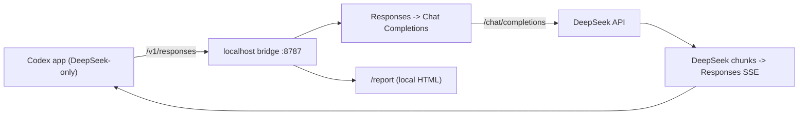
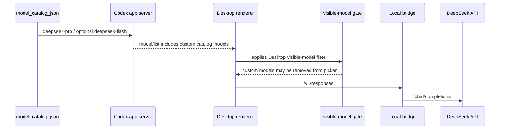

# Architecture

Codex DeepSeek Bridge turns the OpenAI Codex app into a DeepSeek-only coding agent. Codex talks to a
tiny local Responses-compatible server; the server translates to DeepSeek `/chat/completions` and
back. One process serves the bridge and the local report.

## Components

- `bin/codex-deepseek-bridge.mjs` — the CLI (`setup`, `start`, `report`, `doctor`, `restore`,
  `upgrade`, `version`, `status`, `stop`, internal `serve`).
- `src/server.mjs` — the localhost HTTP server and routes.
- `src/translate.mjs` — Responses ⇄ Chat Completions translation, tools, streaming, usage.
- `src/models.mjs` — the two Codex-facing slugs and their upstream mapping.
- `src/catalog.mjs` — the DeepSeek model catalog and the managed `config.toml` block.
- `src/install.mjs` — config writer, key storage, login detect-and-adapt, install state, restore.
- `src/desktop-patch.mjs` — Codex Desktop picker compatibility patch and restore.
- `src/report.mjs` / `src/prompt-diagnostics.mjs` — the local report and cache diagnostics.
- `src/update-check.mjs` / `src/upgrade.mjs` / `src/version.mjs` — version, update check, upgrade.

## Request flow



The server binds `127.0.0.1:8787` and serves:

- `POST /v1/responses` and `POST /responses`
- `GET /v1/models` and `GET /models` — the active DeepSeek catalog
- `GET /health` — liveness, version, and port
- `GET /report` and `GET /report/data` — the local usage and cache report

## Desktop picker compatibility

The Codex app-server can read `model_catalog_json` and return the DeepSeek catalog. Some current
Codex Desktop renderer builds still filter that list through a remote hidden-model allowlist before
rendering the picker. This is tracked upstream in
[openai/codex#19694](https://github.com/openai/codex/issues/19694).

Without the Desktop patch, setup publishes only `deepseek-pro` and sets `model = "deepseek-pro"`.
With the Desktop patch active, setup publishes both `deepseek-pro` and `deepseek-flash`.



When the bridge detects that exact filter, plain `setup` skips the Desktop patch and prints the
explicit opt-in command. Run `setup --desktop-patch` or set `DSCB_DESKTOP_PATCH=on` to make the
renderer decide visible models from the local catalog's `hidden` flag instead of the allowlist gate.

The patch is conservative:

- It is skipped with `DSCB_DESKTOP_PATCH=off`.
- It requires `setup --desktop-patch` or `DSCB_DESKTOP_PATCH=on`.
- It only applies when the known picker filter appears exactly once.
- It also patches known recent-thread provider filters from `modelProviders:null` to an unfiltered
  provider list so local history remains visible across compatible provider switches.
- On macOS, it updates the ASAR file integrity metadata in `Info.plist`.
- On macOS, it re-signs the local Codex app bundle after patching, without deep-signing nested code.
- On macOS, it backs up the root executable too, because signing can rewrite its embedded signature.
- On Windows writable installs, it patches `resources/app.asar` in place after backing it up.
- On Windows Store installs, it mirrors the app into a managed writable copy and writes a launcher.
- It records backups so `restore` can put the original app bundle files back.
- On macOS, it verifies the restored bundle and refuses to ad-hoc re-sign during restore. If Apple's
  original signature cannot be restored, it keeps backups and points the user to reinstall or update
  Codex.

If Codex Desktop later supports custom catalog models without this renderer filter, the patch target
will be absent and `setup` will leave the app untouched.

## The generated Codex config

`setup` writes one managed block at the top of `~/.codex/config.toml` (`%USERPROFILE%\.codex` on
Windows), after backing up any existing file. Config-only mode writes a one-model catalog:

```toml
# >>> codex-deepseek-bridge
# Managed by codex-deepseek-bridge. Run `codex-deepseek-bridge restore` to undo.
model = "deepseek-pro"
model_provider = "deepseek_bridge"
model_catalog_json = "<bridgeHome>/models.json"
model_reasoning_effort = "xhigh"

[model_providers.deepseek_bridge]
name = "DeepSeek (via Codex DeepSeek Bridge)"
base_url = "http://127.0.0.1:8787/v1"
wire_api = "responses"
requires_openai_auth = false
# <<< codex-deepseek-bridge
```

When the Desktop compatibility patch is active, `models.json` also includes `deepseek-flash`.

`setup` may choose a different provider strategy to preserve local history. Current Codex Desktop
builds scope local thread history by provider id, so setup first looks at the original config and
the local thread database:

- If the original or dominant history provider is non-reserved, such as `codex`, setup reuses that
  provider id and writes a temporary `[model_providers.<id>]` table pointing at the bridge.
- If the provider is the reserved built-in `openai`, setup uses the official `openai_base_url`
  override instead of writing `[model_providers.openai]`.
- If the provider is another reserved built-in id, or no useful history exists, setup uses the
  independent `deepseek_bridge` provider shown above.

`restore` stops the bridge background process and writes the original config back from the setup
backup, including any prior proxy base URL or provider table.

`<bridgeHome>` defaults to `<CODEX_HOME>/codex-deepseek-bridge`. It also holds `models.json`,
`deepseek-key`, `install-state.json`, and the daemon's pid and logs.

## Models and reasoning

The bridge knows two Codex-facing slugs. Config-only setup publishes `deepseek-pro`; patched Desktop
setup publishes both. Each maps to a configurable upstream model:

| Codex slug | Upstream model (configurable) |
| --- | --- |
| `deepseek-pro` | `deepseek-v4-pro` (`DEEPSEEK_MODEL_PRO`) |
| `deepseek-flash` | `deepseek-v4-flash` (`DEEPSEEK_MODEL_FLASH`) |

The Codex-facing slugs never change; only the upstream mapping does when DeepSeek ships a new
generation. Unknown or dated slugs fold to the nearest known slug so old sessions keep working.

`models.json` carries both Codex CLI catalog fields (`slug`, `display_name`,
`default_reasoning_level`, `supported_reasoning_levels`) and Codex desktop app-server fields
(`model`, `displayName`, `defaultReasoningEffort`, `supportedReasoningEfforts`). `deepseek-pro` holds
the top catalog priority and is always the default.

Each model exposes three reasoning efforts:

| Codex effort | DeepSeek request |
| --- | --- |
| `none` | `thinking: { type: "disabled" }` |
| `high` | `thinking: { type: "enabled" }`, `reasoning_effort: "high"` |
| `xhigh` (default) | `thinking: { type: "enabled" }`, `reasoning_effort: "max"` |

Any other effort folds to the nearest of the three (`minimal`→`none`; `low`/`medium`→`high`;
`max`→`xhigh`).

## Key resolution

At request time the bridge resolves the DeepSeek key in this order:

1. `DEEPSEEK_API_KEY` in the bridge process.
2. The stored key file `<bridgeHome>/deepseek-key`.
3. A forwarded bearer, only for older configs that still set `requires_openai_auth = true`.

If `DSCB_BRIDGE_API_KEY` is set (advanced, for exposing the bridge beyond localhost), the incoming
bearer gates the bridge and the upstream key must come from steps 1–2.

## Tool calls and reasoning state

- Codex freeform custom tools (such as `apply_patch`) wrap as `{ "input": "..." }` upstream and
  unwrap to a Codex `custom_tool_call`.
- Function tools pass through.
- Namespace tools use unique safe names upstream (for example, `mcp__node_repl__js`) and return the
  original leaf name to Codex (for example, `js`) so Codex can route MCP and plugin tool calls.
- DeepSeek thinking returns `reasoning_content`; the bridge carries it as opaque Codex reasoning
  state for multi-turn continuity. It is compatibility state, not encryption.
- Usage mapping includes DeepSeek cache fields and `input_tokens_details.cached_tokens`.
